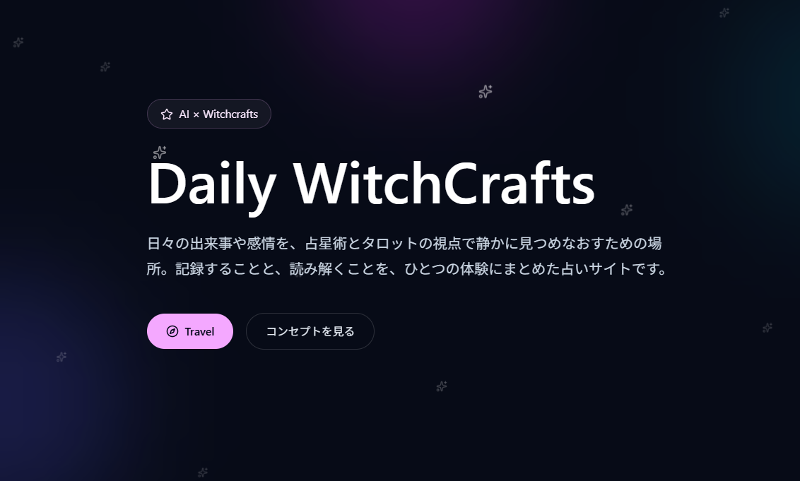

# LovelyWitch Life

LovelyWitch Life is a personal astrology app built with a Django backend and a React frontend. It combines horoscope tools, diary notes, and a soft magical visual style into one private workspace, with a Codex-powered Slack agent layer that assigns roles like planner, frontend, backend, reviewer, and integrator for project work. The project is also organized with portfolio and job-search presentation in mind, so the structure and automation are meant to be easy to explain and review.

## What it does

- Horoscope and chart-related pages for birth data and readings
- A diary area for daily notes, markdown writing, and photos
- A polished landing experience with a distinct witchcraft-inspired mood
- Profile and account pages for signed-in users

## Tech Stack

- Django
- React
- Vite
- Tailwind CSS

## Required API Keys

This repository uses the following API keys and tokens at runtime:

- `OPENAI_API_KEY`
  - Used by the Django horoscope app for AI-generated reading text.
  - For the Django app, set this as an environment variable before starting the backend.
- `SLACK_BOT_TOKEN`
  - Used by `slack-ai-agent` to connect the bot to Slack.
- `SLACK_APP_TOKEN`
  - Used by `slack-ai-agent` for Slack Socket Mode.

- For `slack-ai-agent`, put `SLACK_BOT_TOKEN` and `SLACK_APP_TOKEN` in a role-specific `.env` file under `slack-ai-agent/agents/<role>/.env`, or set them as environment variables

- If both are present, the agent prefers the role-specific `.env` file first and then falls back to the process environment.

- If you are only running the Django/React app and not the Slack agent, you only need `OPENAI_API_KEY` for the AI reading feature.

## Project Structure

- `django_backend/` for the Django project, API endpoints, templates, and media files
- `react_frontend/` for the React app and UI components
- `slack-ai-agent/` for the Codex-driven Slack multi-agent runner with role-based agents like planner, frontend, backend, reviewer, and integrator
- `docs/` for planning notes and supporting documents

## Local Development

- Run the Django server from `django_backend/`
- Run the Vite dev server from `react_frontend/`
- Build the React app into `django_backend/static/react/` for the Django-served production flow

## Notes

This project is designed to feel calm, personal, and easy to use. The goal is to make the experience clear enough for everyday use while keeping the visual identity consistent.
