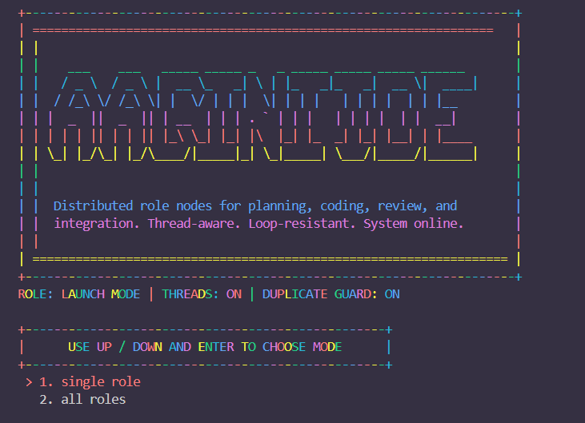
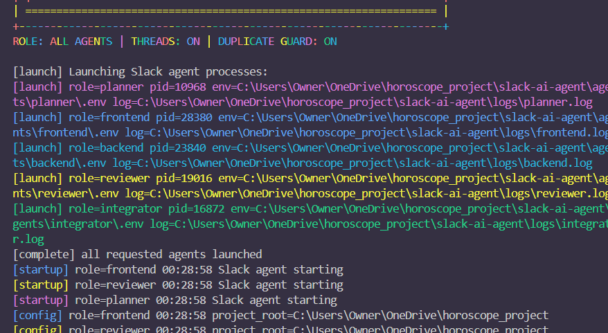

# slack-ai-agent



Slack agent runner for the role instructions in `md/*.md`.

## Setup

- Put role-specific secrets in `agents/<role>/.env`.
- Do not use `slack-ai-agent/.env`.
- `AGENT_STATE_PATH` defaults to `slack-ai-agent/logs/.agent_state.<role>.json`.
- `BANNER_PATH` defaults to `slack-ai-agent/banner.txt`.

API keys are already issued, but they are intentionally not included in this repository.

## Run

```powershell
python .\slack-ai-agent\app.py
```

Use `--role <role>`, `--all`, `--list-roles`, `--no-banner`, or `--env-file <path>` as needed.

Once you activate this app, select All/single.
If the ALL mode chosen, the threads message will 

